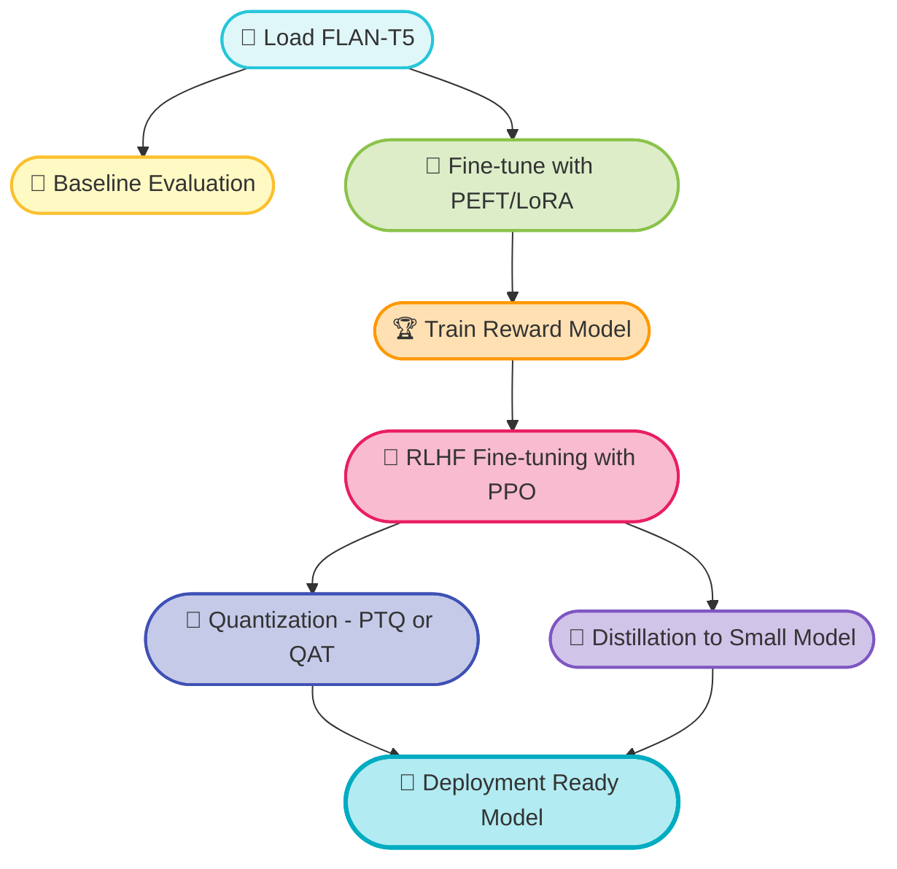

# FlanSummit
🚀 FlanSummit: Dialogue Summarization with FLAN-T5, PEFT Fine-tuning, RLHF, and Model Optimization

**FlanSummit** is an end-to-end applied NLP project that demonstrates how to take an open-source LLM and progressively enhance it for a specialized task — dialogue summarization — through efficient fine-tuning, reinforcement learning, compression, and deployment strategies.

---

## 🎯 Motivation
- Apply **Parameter-Efficient Fine-Tuning (PEFT/LoRA)** to adapt large models with minimal compute.
- Leverage **Reinforcement Learning with Human Feedback (RLHF)** to align model outputs more closely with task-specific rewards.
- Explore **quantization techniques** to optimize the model for production use.
- Perform **distillation** to create lightweight versions of the model for edge deployment.
- Build a **full-stack solution** from training to evaluation to deployment.

---

## 📚 Project Features
- **Base Model:** FLAN-T5-BASE (starting from SMALL to XXL) is an open source LLM first developed by Google using multi task instruction fine-tuning of T5 using FLAN dataset. Refer [this paper.](https://arxiv.org/pdf/2210.11416)

- **Dataset:**  
  - [DialogSum](https://github.com/cylnlp/dialogsum): A Real-life Scenario Dialogue Summarization Dataset.

- **Fine-tuning:** PEFT/LoRA for efficient parameter updates.

- **RLHF:** Reward Model + PPO fine-tuning via HuggingFace `trl`.

- **Quantization:** Exploring Post-Training Quantization (PTQ) and Quantization Aware Training (QAT).

- **Distillation:** Training a smaller student model using logits/soft targets considering the already trained model as the teacher.

- **Evaluation:** ROUGE-1, ROUGE-2, ROUGE-L metrics

---

## 🛠️ Tech Stack

| Component | Library/Tool |
|:---|:---|
| Model Backbone | HuggingFace Transformers |
| Fine-Tuning | PEFT |
| Reinforcement Learning | TRL |
| Quantization | bitsandbytes, Optimum |
| Distillation | HuggingFace Trainer |
| Evaluation | HuggingFace `evaluate`, ROUGE |
| Deployment (optional) | <TBD Gradio/Streamlit, Docker> |


## 📁 Project Structure
```
FlanSummit/
├── data/
│   ├── load_dataset.py
│   └── preprocess.py
├── src/
│   ├── baseline_inference.py
│   ├── train_peft.py
│   ├── train_reward_model.py
│   ├── rl_training.py
│   ├── quantization.py
│   ├── distillation.py
│   └── evaluation.py
├── config/
│   ├── peft_config.json
│   ├── rl_config.json
│   └── quantization_config.json
├── results/
│   └── evaluation_metrics.json
├── README.md
├── requirements.txt
└── setup.sh
```

## ⚡ Quickstart Guide

### 1. Clone the Repository
```bash
git clone https://github.com/yourusername/flansummit.git
cd flansummit
```

### 2. Install Requirements
```bash
pip install -r requirements.txt
```

### 3. Prepare Dataset
```bash
python data/load_dataset.py
```

---

## 🧪 Training and Evaluation Steps

### ➡️ Step 1: Baseline Evaluation
```bash
python src/baseline_inference.py
```

### ➡️ Step 2: Fine-tuning with PEFT/LoRA
```bash
python src/train_peft.py --config config/peft_config.json
```

### ➡️ Step 3: Reward Model Training
```bash
python src/train_reward_model.py
```

### ➡️ Step 4: RLHF Fine-tuning with PPO
```bash
python src/rl_training.py --config config/rl_config.json
```

### ➡️ Step 5: Quantization (PTQ/QAT)
```bash
python src/quantization.py --quant_type ptq
```

### ➡️ Step 6: Distillation to a Smaller Model
```bash
python src/distillation.py
```

### ➡️ Step 7: Final Evaluation
```bash
python src/evaluation.py
```

---

## 📊 Results

TBD

---

---

## 📊 Architecture Flow



---

## 🧐 About the Author
[Bincy Narath](https://www.linkedin.com/in/bincynarath/)
